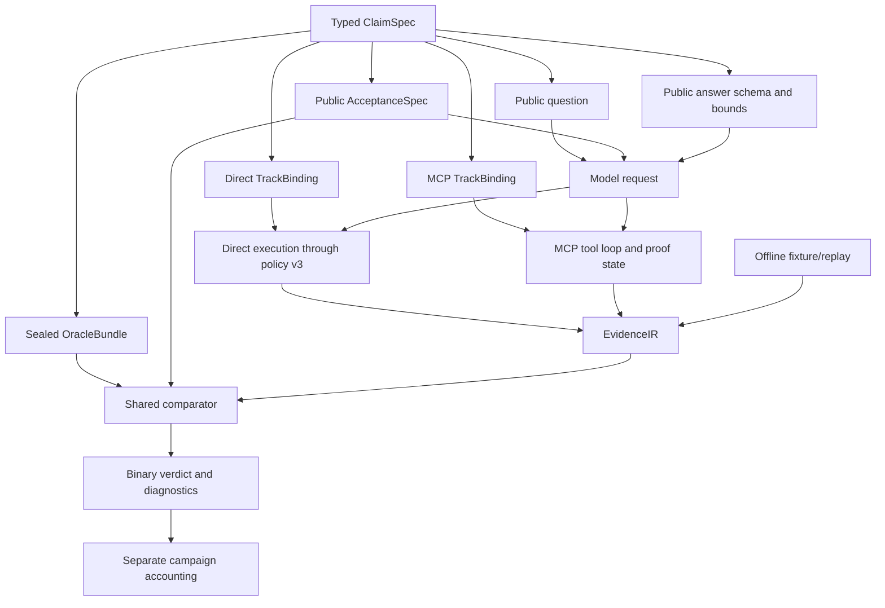

# ORI V2 design rationale

Status: current design explanation for the V29 development boundary
Audience: operators, benchmark authors, reviewers, and anyone who needs to
explain why an ORI score is trustworthy
Last updated: 2026-08-12

This guide starts with a non-technical explanation and progressively exposes
the architecture, decisions, evidence, and mathematics. Read through
“The five-minute explanation” for a presentation-ready overview. Continue into
the later sections when you need to defend a design decision or reproduce a
calculation.

## The 60-second explanation

ORI tests whether a model can reason over a synthetic Active Directory attack
graph in BloodHound. A trustworthy test requires more than asking a question
and checking whether the answer sounds right. ORI must prove that:

1. the intended synthetic graph was generated;
2. that exact graph is the one currently loaded into BloodHound;
3. the model was told every rule that can affect its grade, without seeing the
   answer key;
4. direct Cypher, MCP, and offline replay turn evidence into the same internal
   form;
5. one shared scorer applies the declared rule exactly; and
6. model mistakes remain separate from infrastructure and harness failures.

The central V2 decision is therefore **one typed claim, one public contract,
one sealed oracle, one Evidence IR, and one comparator**. A score is publishable
only when the artifacts, graph, runtime, and result accounting all match their
certified fingerprints.

## The five-minute explanation

Think of ORI as a controlled examination laboratory:

- The generated ZIP is the shipment manifest for a fake enterprise.
- `verify-ingest` checks that BloodHound's warehouse contains the same goods.
- `TaskBundle` and `AcceptanceSpec` are the exam paper and marking rules.
- `OracleBundle` is the sealed answer key.
- `EvidenceIR` is the standard evidence form submitted to the examiner.
- The comparator is the examiner. It receives a policy, sealed oracle, and
  normalized evidence—not a template ID or a model's claim that it is correct.
- Campaign accounting is the invigilator's record of what ran, failed, timed
  out, or never executed.

The frozen V1 campaign taught us that each of those boundaries can distort a
score. A BloodHound failure was once labeled as an expensive model query. Its
regression ledger records recall-oriented set grading that could accept a
correct set plus wrong extras. A single planted route could be treated as the
only correct route. Direct and MCP evidence could reach different graders. A
model could use tools without collecting enough evidence and still unlock
finalization. Those results were useful development evidence, but they could
not support a defensible model ranking.

V2 replaces those implicit assumptions with compiled contracts and executable
certification. V29 retains the complete 46-task direct and 70-task MCP
certification inventories, then schedules one representative for each unique
solver-visible claim: 42 direct and 55 MCP. Complex seed 4401 is the controlled
live graph. The V28 seven-model campaign is preserved as diagnostic incident
evidence; its partial results are not publishable and cannot be resumed under
the V29 fingerprints.

### A presentation-ready talk track

> ORI is a controlled benchmark for Active Directory attack-path reasoning. It
> generates a deterministic graph, verifies that exact graph in BloodHound, and
> then tests direct Cypher and MCP as separate capabilities. Each task is
> compiled from one typed claim into a public acceptance contract and a sealed
> oracle. Every track normalizes its observations into the same Evidence IR and
> uses the same comparator. Exact answer rules, proof completeness, graph
> identity, runtime versions, and task accounting are all fingerprint-bound.
> That is why an ORI V2 score means more than “the answer looked plausible.”

## What the benchmark does—and does not—prove

| Gate | What it proves | What it does not prove |
|---|---|---|
| Generation | A seed deterministically produced a matched archive and manifest | That BloodHound contains the archive |
| Task compilation | Claims, public contracts, sealed oracles, bindings, and bounds are structurally consistent | That a live adapter behaves correctly |
| Offline certification | Adversarial fixtures cross the real track projectors and shared comparator against the archive snapshot | That the live graph matches the archive |
| Health check | BloodHound is reachable and authenticated | That the intended graph is loaded |
| Ingest verification | Projected counts and planted paths match the manifest | That every scorer-relevant live fact and adapter shape agrees |
| Live certification | Archive and live snapshots, track projections, Evidence IR, and verdicts agree across bounded graph gates | That a model will solve the tasks |
| No-model readiness | Current artifacts, graph, model capability, MCP revision, and runtime contracts are compatible | Any model performance result |
| Executed campaign | Model performance under that exact certified contract, if accounting is valid | Performance under a different protocol, graph, prompt, or runtime |

The distinction matters. “BloodHound is healthy” is not “the right graph is
loaded,” and “all tests pass” is not “this model campaign is valid.”

## The architecture in one picture



The public question is a readable projection of the claim, not an independent
source of truth. If a scorer constraint cannot be derived from the public
claim contract, compilation must fail.

## Public information, private truth, and model communication

### What the model sees

A certified request contains exactly one authoritative V2 system prompt and
one compiled user question. The public envelope contains:

- the question;
- the answer JSON schema;
- `AcceptanceSpec`, including the answer policy and every material acceptance
  clause;
- task-neutral execution and output grammar;
- public bounds such as hop ceiling, page/window, tool calls, bytes, and time;
- exact, case-sensitive BloodHound vocabulary needed to express the claim.

These are exam rules, not answer hints. For example, telling every direct model
to return a path as `RETURN p` prevents unsupported Cypher output from being
mistaken for bad reasoning. It does not reveal which path exists.

### What the model never sees

The sealed side contains resolved answer identities, expected sets and counts,
permitted graph witnesses, negative proofs, graph registries, and oracle
fingerprints. Public artifacts and provider requests must not contain
`reference_cypher`, `ref_result`, `valid_node_names`, expected entities,
reference nodes, or a caller-supplied `correct` flag.

When `resource_mode: off`, a discovered BloodHound MCP server prompt is retained
as private provenance but is not injected into the provider request. This was a
specific V10/V28 correction: a resource-first server prompt competed with the
certified claim-bound Cypher proof contract and changed what the harness appeared
to ask the model to do.

## The design principles

### 1. One semantic source of truth

`ClaimSpec` declares what is being asked: source and objective, population,
direct or bounded transitive semantics, mechanisms, ordering, context,
exclusions, and bounds. The compiler derives the question, public acceptance
specification, answer policy, oracle, and track bindings from that claim.

This prevents a common benchmark failure: the prompt asks one thing while a
hidden grader checks another.

`effective` remains available only in capability metadata. It is not an
authorable claim semantic until a separately certified derivation exists.

### 2. Identity before display text

Names are presentation. Stable object IDs are identity. `EntityRef` may retain
an SID, canonical name, domain-qualified name, and aliases, but aliases are
accepted only when they resolve unambiguously. Query selectors use exact live
`name` or `objectid` values; a display alias is not silently treated as a live
graph property.

This prevents two objects with similar names, case transformations, or reused
display labels from being treated as the same answer.

### 3. Evidence, not query-text interpretation

The scorer does not inspect a model's Cypher to decide whether the answer is
correct. Direct and MCP adapters project returned graph objects, ordered edges,
counts, decisions, properties, completeness, and truncation into `EvidenceIR`.
The query text is used only for safety admission and public proof mechanics.

This separates “did the query run safely?” from “does the returned evidence
satisfy the claim?”

### 4. Strict answers with truthful context

Sets and counts are exact. Routes must satisfy their declared relationship and
endpoint semantics. Truthful extra route context can be accepted only when it
is graph-attested, connected to the witness, and permitted by the public
policy. Fabricated, disconnected, or out-of-scope context fails.

This avoids both extremes: accepting a correct core plus arbitrary wrong facts,
or rejecting a correct route merely because BloodHound returned harmless,
truthful context.

### 5. Completeness is a proof obligation

A set answer is not complete merely because a tool call succeeded. The receipt
must mechanically establish the declared page or full population. A negative
answer is not proven by “I did not find anything”; it requires the exact public
bounded search or a logically stronger zero-result search.

### 6. Model, infrastructure, and harness outcomes stay separate

A bad query, malformed answer, or certified task-budget exhaustion can be
model-attributable. Authentication, transport, server availability, and an open
BloodHound circuit are infrastructure. An internal adapter exception is a
harness error. Only gradeable evidence reaches the comparator.

### 7. Certification is invalidated by semantic change

Canonical, sorted JSON is hashed with SHA-256. Task, prompt, oracle, graph,
compiler, comparator, capability, result contract, certifier, bounds, and
catalog fingerprints are bound into certification and readiness. A semantic
change produces a new boundary instead of silently reusing old evidence.

## Decision ledger

The table below records the major decisions, the challenge that forced each
one, and the evidence used to close it.

| ID | Challenge observed | Decision and rationale | How it is implemented and checked |
|---|---|---|---|
| D01 | The first direct campaign became infrastructure-affected and most samples were labeled `QUERY_TOO_EXPENSIVE` | Freeze it as development evidence, not a ranking. Historical outputs must not be retroactively made official | Immutable V1 freeze, hashes, regression fixtures, and a new V2 namespace |
| D02 | Untrusted direct Cypher could destabilize BloodHound | Put a model-blind containment boundary before execution. A safety policy must not coach or repair the model | Every model query goes through `DirectQueryCoordinator` and policy v3, with limits, deny cache, timeouts, health checks, and circuit state |
| D03 | A server failure could look like an expensive query | Attribute only policy rejection and explicit query timeout/complexity to the model; keep auth, transport, server, rate-limit, client timeout, and circuit-open as infrastructure | Typed failure classifier and receipts preserve status, policy rule, execution flag, health, and circuit provenance |
| D04 | Prompt, expected answer, and grader semantics drifted | Compile every solver-visible and sealed artifact from one typed claim | Strict schemas, compiler lints, version dispatch, and hidden-constraint tests |
| D05 | Solver-visible metadata could contain answer material | Split public `TaskBundle` from scorer-only `OracleBundle`; reject answer-side reference fields | Sealed registry plus recursive leakage tests over provider requests, logs, telemetry, CSV, and exports |
| D06 | Direct, MCP, and offline grading derived evidence differently | Normalize all tracks into one `EvidenceIR` and use one comparator | Real direct projection, MCP transcript projection/finalization, and offline replay certification |
| D07 | Template-specific graders could quietly encode exceptions | The comparator accepts only `AnswerPolicy + OracleBundle + EvidenceIR` | Structural tests prevent `template_id` or arbitrary task metadata from reaching comparator dispatch |
| D08 | Recall-only set scoring accepted valid-but-wrong extras | Use exact normalized set equality. Precision and recall remain diagnostics, not alternate pass criteria | Missing and extra object-ID sets must both be empty |
| D09 | Count tolerances hid incorrect enumeration | Use exact integer equality with no implicit tolerance | Expected and observed counts must both exist and be equal |
| D10 | One reference path was treated as the only possible attack path | Distinguish exact route, closed route variants, and mechanism-valid route policies | Ordered edge witnesses are checked against exact variants or declared mechanism/order/context/exclusion rules |
| D11 | Node lists could look like a route even with wrong or reversed relationships | Require an ordered, contiguous edge witness with the declared endpoints; reject cycles, direction errors, detached extras, and missing edges | Route projector and comparator fixtures cover reversed, disconnected, cyclic, decoy, and source/target mismatch cases |
| D12 | “No path found” could be caused by an undeclared filter or incomplete search | Require a bounded-negative proof tied to the public relationship vocabulary, direction, endpoints, and hop ceiling | Zero from the exact scope or a logically stronger search can prove absence; a broader non-zero result is inconclusive |
| D13 | Direct, transitive, and effective membership were implicit | Make semantics an explicit claim and capability field | Separate task contracts and track bindings declare traversal semantics and hop ceilings |
| D14 | Unbounded enumeration created dangerous queries and unusable answers | Certify finite result, page, byte, tool-call, and time bounds | Full MCP sets use public capacity/page mechanics; deterministic window tasks expose their exact offset and limit |
| D15 | MCP finalization used successful activity rather than claim-relevant proof | Finalization depends on typed evidence events relevant to the public claim | Useful positive, valid negative, conclusive/inconclusive empty, truncated, policy, argument, and infrastructure events drive one shared state machine |
| D16 | Structured MCP content blocks were stringified and mislabeled as infrastructure | Unwrap the actual response boundary, recognize pinned shapes, and treat unknown shapes as inconclusive | Captured real receipts cross projector regressions; internal exceptions are `HARNESS_ERROR` |
| D17 | V2 direct instructions encouraged unsupported JSON construction and missed real CE collected-node literals | Reuse the proven V1 CySQL/result grammar, but retain V2 evidence and scoring | Versioned direct result contract accepts node rows, `RETURN p`, scalars, and real collected-node literals without restoring legacy grading |
| D18 | A property-schema mismatch (`key` versus `property_name`) crashed a paid campaign | Make unresolved predicates and resolved facts separate typed boundaries; contain unexpected per-task failures | Adapter regression, schema validation, typed `HARNESS_ERROR`, atomic checkpoint, and campaign invalidation |
| D19 | Early “live parity” compared an offline Evidence IR object with itself | Certification must cross the real direct projector and MCP transcript projector/finalizer | Archive/live raw-response replay, adversarial replay, certifier source fingerprint, and per-fixture adapter parity |
| D20 | A 500-row public page was secretly executed/proved as 100-row subpages | The execution window must be exactly the public claim window; no hidden page or total | Claim selection, binding, projector, prompt, and certification all use the same offset/limit |
| D21 | Whole-task timeout was retried as infrastructure and partial evidence was lost | Treat only the outer certified budget as model-attributable `TASK_TIMEOUT`; preserve typed inner failures and all partial receipts | Nested deadlines, cancellation-safe private state, monotonic attempts, and a lifetime retry budget |
| D22 | Flattened `data.literals` reported zero graph nodes and produced false empty/proof-insufficient outcomes | Derive row cardinality and identities from recognized literal shapes; unknown non-empty literals are inconclusive | Captured BloodHound receipts, alias-lineage checks, `Principal` projection rules, and 500-row serialization bounds |
| D23 | Count and page queries could refer to different populations or distinctness | Bind count and pages to one normalized population, order, and distinctness contract | Variable alpha-normalization, object-ID lineage, contiguous windows, and uniqueness proof when distinct count is paired with row-preserving pages |
| D24 | A resource-first MCP prompt contradicted certified `resource_mode: off` behavior | Send one authoritative V2 system prompt and one compiled question | Provider-payload and prompt-sentinel tests; discovered server prompt remains private provenance only |
| D25 | Strict V10 scoring also contained hidden constraints and rejected truthful evidence | Publish `AcceptanceSpec`, reject hidden constraints at compile time, keep exact answer rules, and accept only graph-attested connected context | Acceptance-equivalence tests, graph fact registry, endpoint/path lineage, and stored-answer diagnostic replay |
| D26 | Old checkpoints could be resumed after scorer or runtime semantics changed | Bind run state and readiness to all material fingerprints and use a fresh output directory after change | Provenance validation rejects stale artifacts and incompatible resumes |
| D27 | Missing, duplicate, or infrastructure-affected samples could distort the denominator | Derive the schedule from the certified catalog and require exactly one reconciled result per task | Exact accounting equations, separate reasoning verdict and campaign validity, and withheld public report on invalid campaigns |
| D28 | V1 and V2 scores measure different contracts | Never use V1 as a raw numerical baseline for V2; compare fresh runs only within the same compatibility boundary | Protocol labels, separate runbooks, immutable historical artifacts, and explicit diagnostic-only replay labels |

## Scoring mathematics

### Identity normalization

Let `N(x)` be the identity resolver that maps a submitted object ID, SID,
canonical name, domain-qualified name, or declared display alias to one stable
object ID. If a value maps to zero or multiple permitted identities, it cannot
be silently chosen as a correct identity.

The comparator's basic string fold is:

```text
F(x) = casefold(collapse_whitespace(strip(x)))
```

For route structure, the property-free edge key is:

```text
K(edge) = (F(source_id), F(relationship), F(target_id), direction)
```

Required edge properties use key-specific value normalization. Extra CE edge
properties do not invalidate a match, but every required property must exist
and match. All set and route equations below operate on normalized object IDs
and canonical relationship names.

### Exact sets

Let `E` be the expected set and `A` the submitted set after normalization.

```text
correct_set = (E = A)
missing     = E - A
extra       = A - E
precision   = |E intersection A| / |A|
recall      = |E intersection A| / |E|
```

Precision and recall have defined empty-set edge cases in the implementation,
but they are diagnostics only. Correctness requires both `missing` and `extra`
to be empty.

Worked example:

```text
E = {Alice, Bob}
A = {Alice, Bob, Mallory}

precision = 2/3
recall    = 2/2 = 1
verdict   = incorrect because extra = {Mallory}
```

This is the mathematical reason V2 does not preserve the frozen V1 campaign's
recorded recall-only set behavior. Perfect recall is not an exact answer.

### Exact counts

For sealed expected count `e` and submitted count `a`:

```text
correct_count = (a exists) AND (e exists) AND (a = e)
```

If `e = 7` and `a = 6`, the answer is incorrect. There is no tolerance band.

### Routes

Represent a returned route as an ordered edge sequence:

```text
R = (edge_1, edge_2, ..., edge_k)
edge_i = (source_id, relationship, target_id, relevant_properties)
```

Every gradeable positive route must first satisfy structural constraints:

- `k >= 1` and `path_status = FOUND`;
- consecutive edges are contiguous;
- the first source and last target match the public selectors;
- edge direction is correct;
- no forbidden entity or edge appears;
- cycles are absent when the policy forbids them;
- required context and properties are covered.

Then the chosen policy applies:

- `ExactRoute`: `R` equals the first sealed ordered route.
- `ClosedRouteVariants`: `R` equals any sealed ordered variant.
- `MechanismValidRoute`: the declared relationship sequence equals the
  observed sequence when extra path edges are forbidden; otherwise it must be
  an ordered subsequence. Every actual edge must still be graph-attested.

For example, a required mechanism sequence
`MemberOf -> MemberOf -> AdminTo` is not satisfied by
`MemberOf -> GenericAll -> AdminTo`, by a reversed `MemberOf`, or by the right
nodes without edge witnesses.

The diagnostic route overlap is Jaccard similarity over canonical edge keys:

```text
route_overlap = |expected_edges intersection actual_edges|
                / |expected_edges union actual_edges|
```

It explains a failure; it does not replace the binary route policy.

`ClosedRouteVariants` is implemented in the schema and comparator but is not
emitted by the current V29 compiler. A finite route list containing sealed
identity alternatives cannot become a hidden acceptance rule; compilation
blocks until those alternatives can be expressed through a solver-visible
contract without leaking the answer.

### Decisions

A decision is correct only when the boolean conclusion matches and every
publicly required evidence condition is satisfied:

```text
correct_decision = decision_matches
                   AND required_evidence_present
                   AND required_entities_covered
                   AND required_context_covered
                   AND required_properties_covered
                   AND extras_obey_public_policy
```

A correct boolean accompanied by fabricated or disconnected evidence is not a
correct evidence-backed decision.

### Bounded negatives

Absence is a conjunction, not an empty search result:

```text
correct_negative = oracle_proves_absence
                   AND model_reports_absence
                   AND no_positive_path_edges
                   AND required_reason_codes_match
                   AND required_properties_are_covered
                   AND required_context_is_covered
                   AND closure_policy_is_satisfied
                   AND extra_facts_are_graph_attested
                   AND extra_edges_are_connected
                   AND properties_are_in_scope
```

The search scope is part of the proof. For a public one-hop relationship claim,
the ordinary one-edge form and `*1..1` are equivalent. A wider search that
returns zero is a stronger absence proof. A wider search that returns non-zero
is inconclusive because its witness may be outside the public bound.

Certification includes a mutation test: inserting one valid witness must flip
both the oracle and the verdict. That shows the negative is tied to graph facts
rather than a permanently hard-coded answer.

Current V28 absence tasks intentionally use one narrow, mechanically provable
shape: a bounded route count of zero, `no_path`, and the declared
`objective_unreachable` reason. The current absence answer schema does not
expose arbitrary context or property evidence. A future richer absence claim
must extend the public schema and acceptance contract before it can compile;
the generic comparator's latent support for richer evidence is not permission
to add a hidden requirement.

### Completeness and pagination

A full exact set needs more than a collection of successful pages. Let:

- `T` be a mechanically reported total for the same normalized population;
- `P_i` be the unique object IDs returned by page `i`;
- `o_i` and `l_i` be its public offset and limit;
- `U = union(P_i)`.

Completeness requires compatible population/filter, ordering, distinctness,
and projection signatures; contiguous declared windows; no failed or truncated
receipt after the final complete proof; and:

```text
offset_i = result_offset + i * page_size
sum(page_rows_i) = T
|U| = T
```

When a distinct count is paired with row-preserving pages, equality of raw row
count is insufficient. Each row must expose one globally unique object ID so
deduplication can be proven.

A deterministic window task is different. It asks for one declared slice, such
as offset 500 and limit 500. Correctness is exact equality with that window; the
harness must not secretly demand a global total or replace it with five hidden
100-row pages.

Current complete MCP set contracts use a fixed public capacity of 1,000
identities and 500-row pages. The capacity is not derived from the sealed answer
size, so it does not leak how many correct identities exist.

### Campaign accounting

For one model and track, define:

- `C`: comparator-correct samples;
- `W`: comparator-incorrect completed samples;
- `M`: model-attributable failures that could not receive a comparator verdict;
- `P`: proof-insufficient samples with no reasoning verdict;
- `X`: infrastructure failures;
- `H`: harness failures;
- `U`: unexecuted samples;
- `S`: scheduled tasks from the certified catalog.

V2 enforces:

```text
S = C + W + M + P + X + H + U
reported_incorrect = W
reasoning_accuracy = C / (C + W)
effective_accuracy = C / S
campaign_valid = (X = 0) AND (H = 0) AND (U = 0)
```

These denominators are deliberate:

- Only a completed comparison can establish semantic correctness or
  incorrectness. A model-attributable syntax error, invalid output, policy
  rejection, or whole-task timeout lowers effective accuracy but has no
  fabricated comparator verdict.
- `PROOF_INSUFFICIENT` has no reasoning verdict. It lowers effective accuracy
  but is not invented as a comparator judgment.
- Infrastructure, harness, and unexecuted samples have no reasoning verdict and
  invalidate the campaign because the scheduled comparison was not completed
  under trustworthy conditions.

#### Worked GPT-5.6 Sol MCP example from the historical V10 campaign

```text
S = 70
C = 38
W = 25
M = 4
P = 3
X = H = U = 0

reasoning_accuracy = 38 / (38 + 25) = 38/63 = 60.317%
effective_accuracy = 38/70 = 54.286%
campaign_valid = true
```

Four additional scheduled outcomes were ungradeable model failures; they lower
effective accuracy but are not comparator-incorrect. The three proof failures
also have no semantic verdict.

#### Worked GPT-5.5 MCP example from the historical V10 campaign

```text
S = 70
C = 35
W = 27
M = 5
P = 3
X = H = U = 0

reasoning_accuracy = 35/62 = 56.452%
effective_accuracy = 35/70 = 50.000%
campaign_valid = true
```

Five additional outcomes were ungradeable model failures. These diagnostic
recomputations describe historical V10 results under the V30 denominator; they
are not an official rescore because the models saw an older prompt/runtime
contract.

### Fingerprint mathematics

ORI serializes fingerprinted objects as canonical sorted JSON and computes:

```text
fingerprint = SHA-256(canonical_semantic_artifact)
```

The operational rule is equality, not similarity. A task compiled with one
comparator or graph fingerprint cannot be resumed or scored as if it belonged
to another.

A uniformly random accidental match to a chosen 256-bit digest has probability
`2^-256`. Generic collision resistance is commonly described as roughly
`2^128` work because of the birthday bound. The practical purpose here is
provenance and compatibility binding, not secrecy: SHA-256 does not hide the
contents of a public artifact.

## Why direct and MCP remain separate tracks

Both tracks use the same synthetic graph and shared comparator, but they test
different model behavior:

| Direct | MCP |
|---|---|
| Model writes the Cypher answer directly | Model reasons through a tool loop |
| One untrusted query is admitted by policy v3 and executed | Multiple calls may gather evidence before finalization |
| Result grammar is nodes, scalar, or actual path | Tool receipts must also prove relevance and completeness |
| Tests Cypher formulation plus graph reasoning | Tests tool selection, iterative reasoning, proof collection, and structured finalization |

Combining them into one raw score would conceal which capability succeeded.
Report direct and MCP separately; any composite must be clearly labeled as a
derived metric.

## Why V1 and V2 numbers are not directly comparable

The frozen historical complex V1 MCP campaign had 62 tasks. Its regression
ledger records recall-oriented set behavior, count tolerances, and route-node
coverage without the relationship proof now required. The current checked-in
legacy grader has evolved since that frozen source commit, which is another
reason not to treat “V1” as one timeless numerical contract. The current V2
complex MCP catalog has 70 tasks, exact typed policies, public acceptance
specifications, and claim-bound execution proof.

V1 GPT-5.6 Sol and GPT-5.5 MCP development scores were 44/62 and 46/62. V10
produced 38/70 and 35/70 raw correct outcomes. Subtracting or ranking those
percentages would conflate task composition, prompts, answer policies, proof
requirements, and runtime behavior.

Stored V10 answers replayed under later corrected scoring preserved every old
correct and diagnostically produced 45/70 for GPT-5.6 Sol and 40/70 for GPT-5.5.
That replay identifies scorer false negatives; it is not an official rescore
because the models saw an older prompt and proof contract. The defensible
comparison is a fresh V28-versus-V28 campaign.

## How the design evolved

### Phase 0: preserve the failure evidence

The first complex V1 campaign was frozen rather than “fixed in place.” Its
direct track became infrastructure-affected, and its MCP contract had known
correctness defects. The freeze established immutable hashes, copied the full
bundle to durable storage, and converted eight defects into regression cases.

### Direct containment: protect BloodHound without coaching the model

The next dependency was direct-query containment. Policy v3 introduced
model-blind admission, timeouts, a policy-scoped deny cache, health checks, and
a circuit breaker. This work remained upstream-authoritative so V2 could adapt
its receipts without duplicating or weakening safety behavior.

### Initial V2: typed claims, sealed oracles, and shared evidence

The first architecture pass created strict schemas, protocol dispatch, identity
resolution, `EvidenceIR`, typed answer policies, one comparator, certification,
graph fingerprints, and exact task accounting. A representative vertical slice
was certified before the full simple and complex corpora were migrated.

### Runtime reality: structured MCP responses and direct result grammar

Real campaigns exposed shapes that deterministic mocks had missed. MCP returned
structured text-content blocks, not plain JSON strings. Direct V2 had lost the
proven V1 CySQL grammar and failed to understand real collected-node literals.
The correction reused the successful V1 execution contract while keeping the
new V2 scorer and oracle boundary.

### Property crash and real adapter parity

A `PropertyPredicate.key`/`property_name` mismatch crashed a live campaign.
That incident led to stricter nested schemas, typed unresolved/resolved property
boundaries, per-task harness containment, atomic checkpoints, and a broader
audit. The audit then found that “live parity” compared an offline Evidence IR
with itself. Certification was rebuilt to cross the real direct and MCP
projectors and finalizer.

### V7 and V8: pagination, timeouts, and failure accounting

The first complex MCP run showed a public 500-row request paired with hidden
100-row mechanics, whole-task timeout mislabeled as infrastructure, discarded
partial receipts, and proof failure conflated with malformed output. V7 aligned
the page contract and outcome taxonomy. V8 added nested timeouts, lifetime retry
accounting, cancellation-safe receipts, strict JSON output, and claim-relevant
Cypher proof.

### V9 and V10: real BloodHound literal and proof shapes

V8 then showed thirteen exact-correct answers as `PROOF_INSUFFICIENT`. The MCP
projector had treated flattened scalar identity rows as zero graph results. V9
added captured literal receipts, identity-row cardinality, alias lineage,
abstract `Principal` handling, and 500-row serialization bounds.

V9 exposed a second issue: positive path graph witnesses accompanied by endpoint
scalars were still inconclusive. V10 preferred real graph cardinality for
route/decision witnesses and tightened selector, label, ordering, count/page
population, and distinctness bindings.

### API latency calibration: turn bounds plus wall-clock safety

The first Flash-model API campaign showed that a 60-second Direct deadline
measured provider latency more often than reasoning: 28 of 42 Qwen Direct
requests reached the deadline before any Cypher query executed. Two large MCP
page tasks also exhausted 555 seconds after only four to six tool calls, so the
existing turn/tool allowance was not the binding limit. ORI therefore retains
finite model-step and tool-call budgets while increasing Direct whole-task time
to 180 seconds, MCP provider reads to 240 seconds, and public MCP whole-task time
to a 600-second floor with a capacity-derived allowance capped at 1,200 seconds.
The wall clock remains a runaway safety boundary rather than the primary unit of
agent work. A whole-task timeout remains operationally model-attributable but
receives no semantic correctness verdict.

### V11 and V15: strict scoring must also be fair and public

The V10 score drop contained genuine model errors and harness-created false
negatives. V11 added solver-visible `AcceptanceSpec`, blocked hidden scorer
requirements, distinguished direct User from Principal membership, redesigned
bounded negatives, accepted truthful graph-attested context, and removed
answer-size-derived bounds.

The V15 audit further aligned one authoritative provider prompt, endpoint-bound
paths, scalar identity rows, connected context, graph property registries, and
known CE normalization. Stored-answer replay was diagnostic proof of scorer
repair, not a substitute for a fresh campaign.

### V16 through V20: adversarial review closures

Independent review continued to find narrow proof-boundary cases:

- wider non-zero negative searches needed to remain proof-insufficient;
- returned paths needed lineage through `WITH` aliases and actual nodes/edges;
- omitted `SKIP 0` and renamed page variables needed one population identity;
- selectors introduced after a detached match could not bind a returned path;
- anonymous `COUNT(*)` needed safe population equivalence;
- multiline projections and distinct count/page semantics needed preservation;
- `circuit_open` had to remain infrastructure;
- conflicting endpoint selectors had to invalidate negative proof; and
- ordinary one-hop syntax had to be accepted as equivalent to `*1..1`.

Each semantic change invalidated the previous certification and produced a
fresh artifact boundary. V21 through V27 were intermediate review boundaries
and are intentionally stale.

### V28: historical scorer and communication boundary

V28 closes the current prompt/scorer review: one authoritative prompt, one
question, public material acceptance clauses, exact hop and case-sensitive
vocabulary, corrected bounded-negative alignment, legitimate direct/MCP
evidence forms, strict rejection of contradictory selectors, and truncation-
safe completeness state.

The complete repository suite passed 730 tests, Ruff, lock and diff validation,
and an isolated publishable-source secret scan. Complex seed 4401 passed 276
direct and 420 MCP offline fixtures, then all three live graph gates with 46/46
direct and 70/70 MCP candidates. Simple seed 1234 has 20/20 direct and 40/40 MCP
offline-certified candidates; its V28 live gate remains pending the explicitly
approved graph replacement and restoration.

### V29: evidence binding, query-shape, catalog, and durability closure

The first seven-model high-effort V28 run made one distinction especially
important: strict grading is trustworthy only when the public instructions,
BloodHound's real result shape, and the projector agree. A strict scorer cannot
repair an undeclared return-shape requirement after the model has answered.

Four V29 changes follow directly from that principle:

1. A direct query that returns a supporting relationship must also return both
   endpoint node variables. BloodHound can otherwise omit the non-path node,
   leaving an internal numeric endpoint that no public identity resolver can
   safely recover. The prompt now says this explicitly; the projector rejects
   the omission as model-attributable invalid output instead of crashing.
2. Bounded negative tasks accept the standard zero-preserving
   `OPTIONAL MATCH p=... RETURN count(p)` form only after exact public source and
   target singletons are bound. This accepts a valid zero proof without opening
   the door to unbound, contradictory, or silently filtered absence claims.
3. Query construction no longer asks the model to prove path simplicity with
   every pairwise node inequality. That produces O(n-squared) predicates:
   `n(n-1)/2` comparisons for `n` nodes. The comparator already observes the
   returned ordered witness and rejects an actual repeated-node cycle, so the
   public contract tells the model to return a bounded witness without those
   planner-hostile filters.
4. MCP graph facts are bound to complete claim-relevant receipts. Complete set
   pages can materialize the answer directly, while final edges and properties
   that do not appear in the authoritative receipt fail closed.

V29 also separates the *certification inventory* from the *scoring unit*. Two
task IDs that present the same public question, acceptance rules, schema,
execution bounds, and track binding are not two independent trials. The public
semantic fingerprint groups them, the lexicographically first ID is scheduled,
and `equivalent_task_ids` preserves the complete class. Before grouping, ORI
requires the sealed scorer outcomes to be equal; disagreement blocks release.

For complex seed 4401:

```text
direct: 46 certified tasks / 42 unique public semantics = 91.30%
MCP:    70 certified tasks / 55 unique public semantics = 78.57%
saved seven-model attempts = 7 * ((46 + 70) - (42 + 55)) = 133
relative campaign reduction = 133 / 812 = 16.38%
```

Finally, an externally terminated run proved that task-level atomic state was
not enough for operator confidence. V29 adds one exclusive output-directory
lock, file and directory `fsync`, a fingerprinted campaign lifecycle receipt,
durable interruption state, and per-track report publication after each track's
post-graph gate. An interrupted attempt remains auditable but does not consume
the next process's original infrastructure-retry allowance.

No-model readiness then found that the local Bloodhound-MCP checkout had moved
from `009c88f` to `92a37dd`. V29 did not relax the revision check. Review showed
that the newer revision adds startup credential preflight and byte-upload tool
variants while preserving the read-only Cypher callable. ORI advanced the
capability profile to `ori-mcp-92a37dd-bhce-9.1-cypher-v7` and repeated compile
and live certification so the larger callable/startup surface is bound
explicitly.

## Certification and adversarial fixtures

Every migrated task has a fixture manifest. Applicable cases include:

- perfect;
- wrong;
- empty;
- alias;
- extra entity;
- decoy;
- alternative route;
- reversed edge;
- disconnected path;
- cycle;
- malformed answer; and
- source/target mismatch.

When a fixture is structurally inapplicable to a claim kind, the compiler must
record why, while an adversarial micrograph still covers the underlying policy.
Certification does not merely call the comparator. It crosses the same schema,
identity, direct/MCP adapter, finalization, and Evidence IR boundaries used by a
campaign.

Live certification computes a bounded graph digest before, between, and after
the track projections. A graph change invalidates certification and the run.
Harness-owned reads are bounded and read-only; upload or database replacement
is a separate operator-approved action.

## How to read a result

Ask these questions in order:

1. Does the result identify protocol, graph, catalog, compiler, comparator,
   capability, and runtime fingerprints?
2. Did health, exact ingest, live certification, and readiness pass?
3. Does exact task accounting balance?
4. Is the campaign valid, with zero unresolved infrastructure, harness, and
   unexecuted samples?
5. What are the direct and MCP results separately?
6. For MCP, what are reasoning accuracy, effective accuracy, and proof failures?
7. Which incorrect outcomes are comparator verdicts versus model-attributable
   execution/output failures?
8. Is the comparison against another run inside the same compatibility
   boundary?

A high reasoning accuracy with many proof failures can still have a much lower
effective accuracy. Any unresolved infrastructure or harness failure prevents a
clean model comparison regardless of the apparent percentage.

## Common misconceptions

**“ORI V2 is just prompt engineering.”**
It is a compiled evaluation protocol with sealed truth, typed evidence, live
graph validation, safety containment, and exact accounting.

**“BloodHound health means the right dataset is loaded.”**
Health proves reachability. Ingest verification and graph fingerprints prove
dataset identity.

**“A plausible route is close enough.”**
The ordered relationship witness, endpoints, direction, mechanisms, context,
and exclusions are the claim.

**“An empty query result proves no path.”**
Only a complete public bounded search or logically stronger zero-result search
can prove absence.

**“A timeout always means infrastructure.”**
No. The certified whole-task budget is model-attributable. Provider, transport,
tool, BloodHound, and harness timeouts retain different scopes.

**“Old answers can simply be rescored as an official result.”**
They can diagnose scorer changes, but the model saw a different prompt and
proof contract. Official comparison requires a fresh compatible campaign.

**“Direct and MCP should be averaged automatically.”**
They measure different capabilities. Keep them separate unless a clearly
defined downstream composite is intentionally introduced.

## Current status and remaining limits

As of this document's date:

- V29 is the current executable complex V2 boundary.
- Complex seed 4401 retains 46 direct and 70 MCP certified tasks and schedules
  42 direct and 55 MCP unique public-semantic representatives.
- Simple seed 1234's 20-direct/40-MCP V28 proof remains historical. V29 changed
  compiler, adapter, finalization, certifier, and MCP capability fingerprints,
  so a future simple V29 run requires the same operator-approved graph swap and
  fresh live certification.
- The operator-approved temporary simple upload and three-gate certification
  completed, after which the exact complex seed-4401 archive was restored.
  Complex again passes health, exact node counts, all 30/30 planted paths, and
  the V29 graph fingerprint.
- The feature branch still awaits final reconciliation after the direct-query
  containment PR reaches `master`; this is PR integration work, not part of the
  completed benchmark-correctness goal.
- The partial paid V28 seven-model campaign is diagnostic incident evidence,
  not a publishable ranking. It cannot be resumed under V29.
- The later Task Selector Suite and final official 100-task selection per track
  are separate future work.

The exact current complex boundary is:

| Boundary | V29 value |
|---|---|
| Compiler | `ori-claim-compiler-v2.11.0` |
| Comparator | `ori-v2-comparator-8` |
| Direct result contract | `ori-direct-result-contract-v14` |
| MCP result contract | `ori-mcp-result-contract-v23` |
| MCP evidence/finalization | `ori-mcp-evidence-v22` |
| MCP capability profile | `ori-mcp-92a37dd-bhce-9.1-cypher-v7` |
| Campaign runner | `ori-v2-model-campaign-v12` |
| Live certifier | `ori-live-certifier-v24` |
| Complex graph fingerprint | `fb0b6785e524d40abcc9033ea2c7887eaa88e13bb6cb1f329636a4ce4b74b1c4` |
| Certified/scheduled direct | 46 / 42 |
| Certified/scheduled MCP | 70 / 55 |
| Readiness config | A machine-local config was used; operator configs are not distributed. |

These limits are part of the result, not footnotes to hide. A trustworthy
benchmark says exactly what has and has not been proven.

## Glossary

| Term | Meaning |
|---|---|
| `ClaimSpec` | Typed semantic source for the question, policy, oracle, bindings, and bounds |
| `TaskBundle` | Public solver-visible task artifact |
| `AcceptanceSpec` | Public, typed statement of every material grading rule |
| `OracleBundle` | Private scorer-only resolved truth and graph proof |
| `EntityRef` | Stable typed identity with object ID and controlled aliases |
| `TrackBinding` | Direct or MCP execution realization of a claim |
| `EvidenceIR` | Canonical internal evidence shared by direct, MCP, and offline replay |
| Comparator | Shared binary correctness function over policy, oracle, and Evidence IR |
| DirectQueryCoordinator | Authoritative safety and execution path for untrusted direct/model-issued Cypher |
| Capability profile | Versioned declaration of what a track/runtime can reliably prove |
| Candidate | A task that has reached the required certification state for campaign scheduling |
| Offline certification | Fixture and adapter/comparator validation against the archive graph |
| Live certification | Read-only archive/live graph and adapter parity validation |
| Proof failure | Schema-valid final answer without enough claim-relevant execution evidence; no reasoning verdict |
| Model failure | Model-attributable execution/output failure counted as incorrect |
| Campaign validity | Whether infrastructure, harness, and scheduling completed cleanly enough for comparison |

## Source map

- [Benchmark Hardening Runbook](benchmark-hardening-runbook.md) summarizes the
  V1 failure taxonomy and the V2 scoring boundaries.
- [V2 Task Authoring and Certification](benchmark-v2-task-authoring.md)
  documents the current task implementation and certification contract.
- [V2 Certification Evidence](benchmark-v2-certification-evidence.md) records
  corpus counts, deterministic generation, live graph gates, artifact
  fingerprints, and review closures.
- [V2 Task Authoring and Certification](benchmark-v2-task-authoring.md) is the
  operational contract for adding a task family.
- [Benchmark Hardening Runbook](benchmark-hardening-runbook.md) covers runtime
  failure taxonomy, safety, scoring, and operator procedures.
- [`schema.py`](../src/ori/eval/v2/schema.py) defines the strict typed contracts.
- [`compiler.py`](../src/ori/eval/v2/compiler.py) compiles claims into public and
  sealed artifacts.
- [`evidence.py`](../src/ori/eval/v2/evidence.py) and
  [`identity.py`](../src/ori/eval/v2/identity.py) define normalized evidence and
  identity resolution.
- [`comparator.py`](../src/ori/eval/v2/comparator.py) implements answer-policy
  correctness.
- [`scoring.py`](../src/ori/eval/v2/scoring.py) implements exact campaign
  accounting and metrics.
- [`direct_adapter.py`](../src/ori/eval/v2/direct_adapter.py),
  [`mcp_adapter.py`](../src/ori/eval/v2/mcp_adapter.py), and
  [`model_runtime.py`](../src/ori/eval/v2/model_runtime.py) implement track
  evidence and runtime boundaries.
- [`certification.py`](../src/ori/eval/v2/certification.py) and
  [`live_projection.py`](../src/ori/eval/v2/live_projection.py) implement
  offline/live adapter parity.
